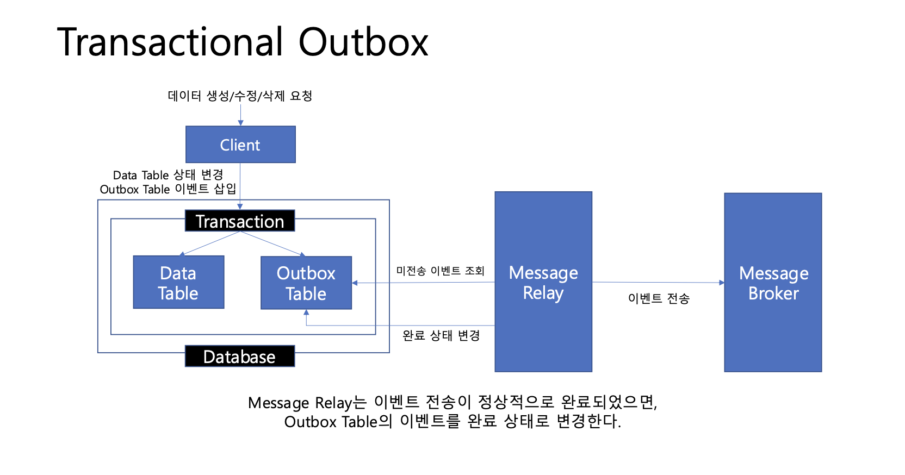
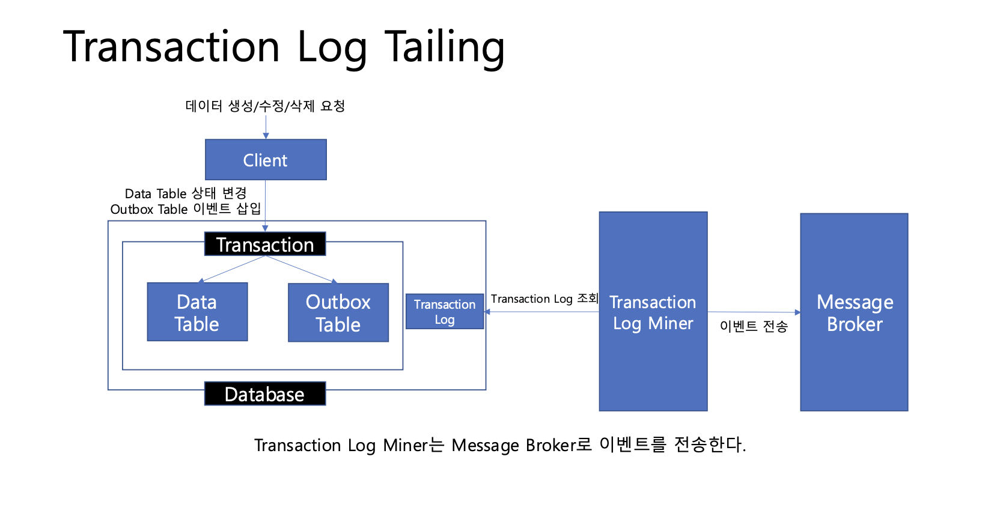
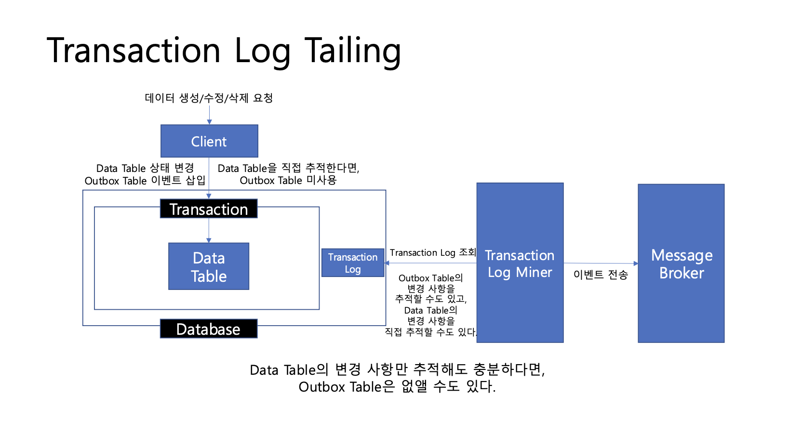

`
docker run --name kuke-board-mysql -e MYSQL_ROOT_PASSWORD=root -d -p 3306:3306 mysql:8.0.38
docker exec -it kuke-board-mysql bash
mysql -u root -p
create database article;
`


```sql
create table article (
    article_id bigint not null primary key,
    title varchar(100) not null,
    content varchar(3000) not null,
    board_id bigint not null,
    writer_id bigint not null,
    created_at datetime not null,
    modified_at datetime not null
)
```

```sql
select * from article where board_id order by created_at desc limit 30 offset 90;
create index idx_board_article_id on article(board_id asc, article_id desc);
select * from article where board_id = 1 order by article_id desc limit 30 offset 90;
select * from article where board_id = 1 order by article_id desc limit 30 offset 1499970;
/*
 인덱스를 알아야해
 
 MySQL의 기본 스토리지 엔진 innoDB
 
 */

select board_id, article_id from article where board_id = 1 order by article_id desc limit 30 offset 1499970;
select * from ( select article_id from article where board_id = 1 order by article_id desc limit 30 offset 1499970) t left join article on t.article_id = article.article_id;

/*
 페이지 공식
 (((n-1) / k) + 1) * m * k + 1
 */
 
 select count(*) from (select article_id from article where board_id = 1 limit 300301) t;
```

```sql
/*
무한 스크롤 예시
*/
select * from article where board_id = 1 order by article_id desc limit 30;
select * from article where  board_id = 1 and article_id < 12345678 order by article_id desc limit 30;

```

```sql
/*
 댓글 기능 개발
 */
 create table comment (
     comment_id bigint not null primary key,
     content varchar(3000) not null ,
     article_id bigint not null ,
     parent_comment_id bigint not null ,
     writer_id bigint not null ,
     deleted bool not null ,
     created_at datetime not null 
 );

create index idx_article_id_parent_comment_id_comment_id on comment(
        article_id asc,
        parent_comment_id asc,
        comment_id asc 
    );

/**
  N번 페이지에서 M개의 댓글 조회
 */
 select * from (
     select comment_id from comment
                       where article_id = {article_id}
                       order by parent_comment_id asc, comment_id asc 
                       limit {limit} offset {offset}
               ) t left join comment on t.comment_id = comment.comment_id;

/**
  댓글 개수 조회
 */
select count(*)
from (select comment_id from comment where article_id = {article_id} limit {limit}) t;


/*
 댓글 테이블 설계 - 무한 depth
 */

select table_name, table_collation from information_schema.Tables where table_schema = 'comment';

create table comment_v2 (
     comment_id bigint not null primary key,
     content varchar(3000) not null ,
     article_id bigint not null ,
     writer_id bigint not null ,
    path varchar(25) character set utf8mb4 collate utf8mb4_bin not null,
     deleted bool not null ,
     created_at datetime not null
);

create unique index idx_article_id_path on comment_v2(
        article_id asc, path asc
    );

select table_name, column_name, collation_name from information_schema.COLUMNS where table_schema = 'comment' and table_name = 'comment_v2';;

explain select path from comment_v2 where article_id = 1 and path > '00a0z' 
 and path like '00a0z%'
 order by path desc limit 1;
```

```sql
/*
 좋아요 설계
 - mysql을 사용하는데 유니크 인덱스를 사용하면 이를 손쉽게 구현 가능
 - 게시글 id + 사용자 id로 유니크 인덱스를 만들면 된다.
 */

create table article_like (
    article_like_id bigint not null primary key,
    article_id bigint not null,
    user_id bigint not null,
    created_at datetime not null
);

create unique index idx_article_id_user_id on article_like(article_id asc, user_id asc);


/*
 락 테스트를 위한 테이블
 */
 create database test_db;
 create table lock_test (
     id bigint not null primary key,
     content varchar(100) not null
 );

insert into lock_test values (1234, 'test');

start transaction;

update lock_test set content='test2' where id = 1234;

select * from performance_schema.data_locks;


/*
 좋아요 테이블
 */
 create table article_like_count (
     article_id bigint not null primary key,
     like_count bigint not null,
     version bigint not null
 );

/*
 게시글 수, 댓글 수
 */
 create table board_article_count (
     board_id bigint not null primary key,
     article_count bigint not null
 );

create table article_comment_count (
    article_id bigint not null primary key,
    comment_count bigint not null
);

```

```markdown
docker run --name kuke-board-redis -d -p 6379:6379 redis:7.4
```

```sql
create database article_view;
       
use article_view;

create table article_view_count (
    article_id bigint not null primary key,
    view_count bigint not null
);
```

```markdown
docker run -d --name kuke-board-kafka -p 9092:9092 apache/kafka:3.8.0

토픽 생성
docker exec --workdir /opt/kafka/bin -it kuke-board-kafka sh

./kafka-topics.sh --bootstrap-server localhost:9092 --create --topic kuke-board-article --replication-factor 1 --partitions 3
./kafka-topics.sh --bootstrap-server localhost:9092 --create --topic kuke-board-comment --replication-factor 1 --partitions 3
./kafka-topics.sh --bootstrap-server localhost:9092 --create --topic kuke-board-like --replication-factor 1 --partitions 3
./kafka-topics.sh --bootstrap-server localhost:9092 --create --topic kuke-board-view --replication-factor 1 --partitions 3
```

```markdown
Transactional Messaging 달성을 위한 분산 트랜잭션의 방법
- Two Phase Commit
- Transactional Outbox
- Transactional Log Tailing
```

## Two Phase Commit
분산 시스템에서 모든 시스템이 하나의 트랜잭션을 수행할 때,
모든 시스템이 성공적으로 작업을 완료하면, 트랜잭션 commit
하나라도 실패하면 트랜잭션 rollback

이름에서 알 수 있듯, 두 단계로 나뉘어 수행
- Prepare phase(준비 단계)
Coordinator는 각 참여자에게 트랜잭션을 커밋할 준비가 되었는지 물어본다
각 참여자는 트랜잭션을 커밋할 준비가 되었는지 응답한다.
- Commit phase(커밋 단계)
모든 참여자가 준비 완료 응답을 보내면, Coordinator는 모든 참여자에게 트랜잭션 커밋을 요청한다.
모든 참여자는 트랜잭션을 커밋한다.


### 문제점
- 모든 참여자의 응답 기다려야하기 때문에 지연이 길어질 수 있다.
- Coordinator 또는 참여자 장애가 발생하면,
  - 참여자들은 현재 상태를 모른 채 대기해야 할 수도 있다.
  - 트랜잭션 복구 처리가 복잡해질 수 있다.
* 성능 및 오류처리의 복잡성 문제 존재
* 우리 시스템은 kafka와 mysql 작업을 트랜잭션으로 처리해야 하는데 kafka와 mysql은 자체적으로 이러한 방식의 트랜잭션 통합을 지원하지 않는다
* Two Phase Commit은 Transactional Messaging 처리하기 적절하지 않음


## Transactional Outbox
- 이벤트 전송 작업을 일반적인 데이터베이스 트랜잭션에 포함 시킬 수는 없다.
- 하지만, 이벤트 전송 정보를 데이터 베이스 트랜잭션에 포함하여 기록할 수는 있다.
  - 트랜잭션을 지원하는 데이터베이스에 Outbox 테이블을 생성하고,
  - 서비스 로직 수행과 Outbox 테이블 이벤트 메시지 기록을 단일 트랜잭션으로 묶는다.

### 과정
1. 비즈니스 로직 수행 및 Outbox 테이블 이벤트 기록
   1. Transaction start
   2. 비즈니스 로직 수행
   3. Outbox 테이블에 전송할 이벤트 데이터 기록
   4. commit or abort
2. Outbox 테이블을 이용한 이벤트 전송 처리
   1. Outbox 테이블 미전송 이벤트 조회
   2. 이벤트 전송
   3. Outbox 테이블 전송 완료 처리
   4. 



* Two Phase Commit의 성능과 오류 처리에 대한 문제가 줄어든다
* 데이터베이스 트랜잭션 커밋이 완료되었다면, Outbox 테이블에 이벤트 정보가 함께 기록되었기에, 이벤트가 유실되지 않는다.
* 추가적인 Outbox 테이블 생성 및 관리가 필요하다.
* Outbox 테이블의 미전송 이벤트를 Message Broker로 전송하는 작업이 필요하다.

### 그렇다면 Message Broker로 이벤트를 전송하는 작업은 어떻게?
* 이벤트 전송 작업을 처리하기 위한 시스템을 직접 구축해볼 수 있고,
* Transaction Log Tailing Pattern을 활용할 수도 있다.

### Transaction Log Tailing
* 데이터베이스의 트랜잭션 로그를 추적 및 분석하는 방법
  * 데이터베이스는 각 트랜잭션의 변경 사항을 로그로 기록한다.
  * MySql binlog, PostgreSQL WAL, SQL Server Transaction Log 등
* 이러한 로그를 읽어서 Message Broker에 이벤트를 전송해 볼 수 있다.
  * CDC(Change Data Capture) 기술을 활용하여 데이터의 변경 사항을 다른 시스템에 전송한다.
  * 변경 데이터 캡처(CDC) : 데이터 변경 사항을 추적하는 기술




* 데이터베이스에 저장된 트랜잭션 로그를 기반으로, Message Broker로의 이벤트 전송 작업을 구축하기 위한 방법으로 활용될 수 있다.
* Data Table을 직접 추적하면, Outbox Table은 미사용 할 수도 있다.
* 트랜잭션 로그를 추적하기 위해 CDC 기술을 활용해야 한다.

### Oubox Table 필요성?
* Transaction Log Tailing을 활용하면 Data Table의 변경 사항을 직접 추적할 수 있다.
  * Outbox Table이 필요하지 않을 수 있다.
* 하지만, Data Table은 메시지 정보가 데이터베이스 변경사항에 종된 구조로 한정 된다.
* Outbox Table을 활용하면
  * 부가적인 테이블로 인한 복잡도 및 관리 비용은 늘어나지만,
  * 이벤트 정보를 더욱 구체적이고 명확하게 정의할 수 있다.
* 따라서, Outbox Table을 활용한다.

### Transaction Log Tailing의 활용?
* 이벤트 전송 작업을 직접 개발하지 않을 수 있다.
* 올바르게 활용하려면 새로운 기술(CDC 등)에 대한 학습 및 운영 비용이 필요하다.
* 우리는 이미 익숙한 스프링부트를 활용하여 개발하고 있다.
* 위 패턴을 활용하지 않더라도, 직접 개발함으로써 익숙한 환경에서 관리하고 적은 운영 비용을 가져갈 수 있다.
* 따라서, Transaction Log Tailing은 활용하지 않는다.

```sql
create table outbox(
    outbox_id bigint not null primary key,
    shard_key bigint not null,
    event_type varchar(100) not null,
    payload varchar(5000) not null,
    created_at datetime not null
);

create index idx_shard_key_created_at on outbox(shard_key asc, created_at asc);

```
